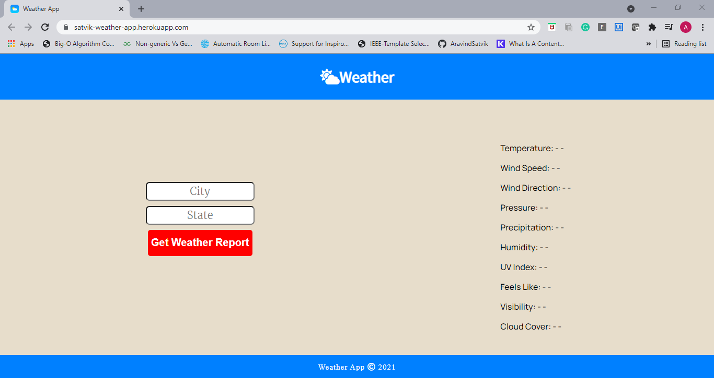
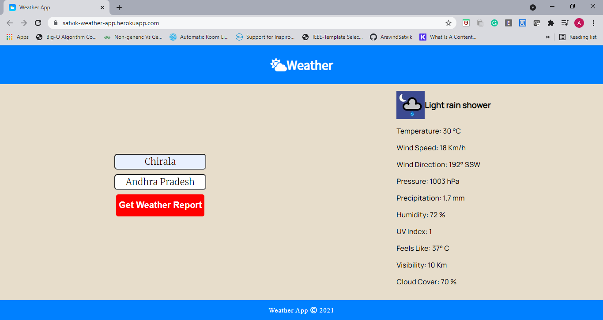
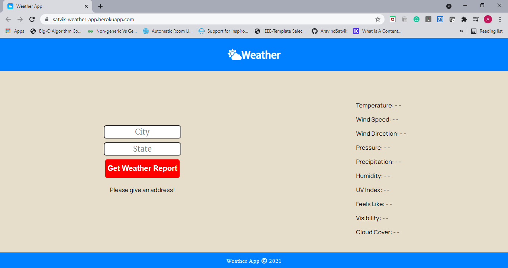
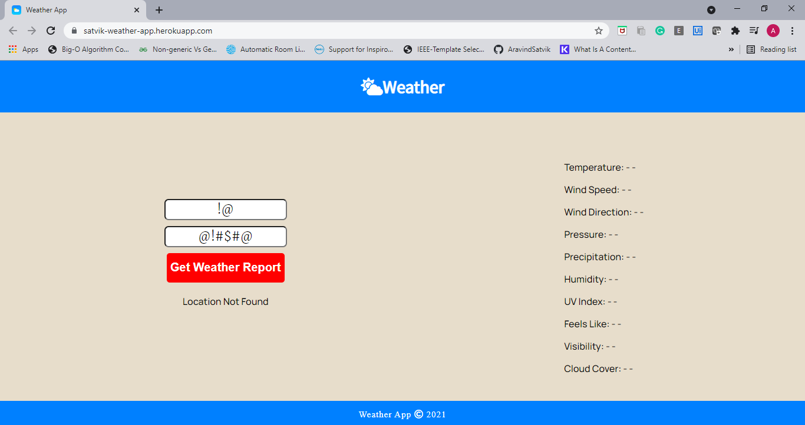

# Weather-App
A web application designed to get the weather information of the desired location. HTML, CSS, and JavaScript are used for the front-end, and Node JS is used for the back-end along with some NPM packages.

Initial Display of the Webpage

Weather Report for a Location

Testing Weather App by leaving the input fields empty

Testing Weather App by entering Invalid Location

